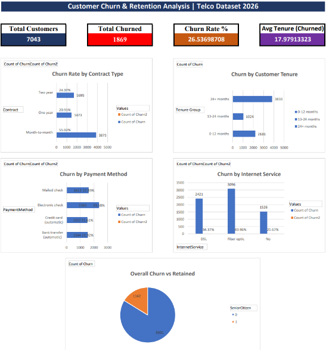

# 📊 Customer Churn & Retention Analysis

## 🔍 Overview
Analyzed 7,043 telecom customer records to identify 
churn patterns and retention opportunities.

## 🛠️ Tools Used
- Microsoft Excel (Data Cleaning & Pivot Tables)

## 📁 Dataset
Telco Customer Churn Dataset — Kaggle

## 🎯 Key Findings
- Overall churn rate: **26.5%**
- Month-to-month customers churn at **~42%**
- New customers (0–12 months) are highest risk
- Fiber optic users churn more despite paying more
- Electronic check users show highest churn rate

## 💡 Recommendations
1. Convert month-to-month customers to annual plans
2. Onboarding program for first 12 months
3. Promote auto-pay methods
4. Loyalty offers for senior citizens

## Dashboard Preview

## 👤 Author
Amrita Chakraborty
